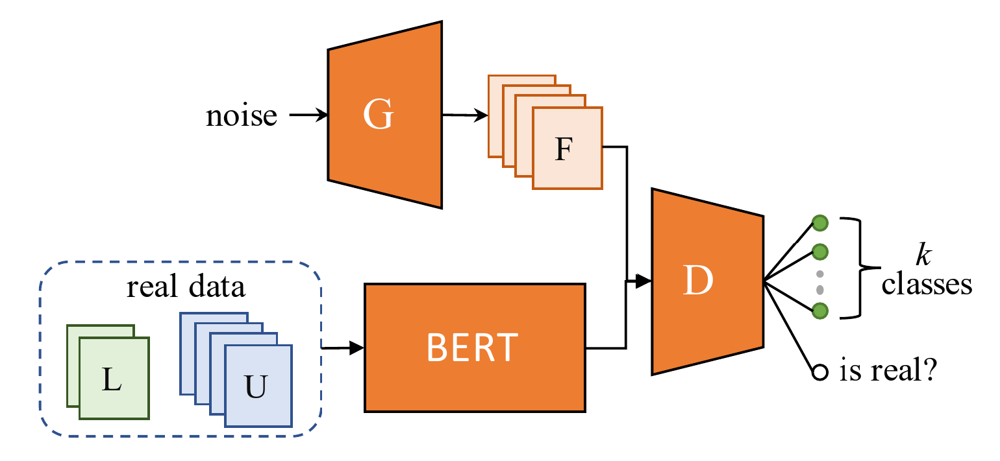

# GAN-BERT for Machine-Generated Text Detection

Final project for the **Deep Learning course (Fall 2024)** at **Sharif University of Technology**.

This project studies semi-supervised text classification using BERT and [GAN-BERT](https://doi.org/10.18653/v1/2020.acl-main.191) for detecting whether a piece of text was written by a human or generated by a language model. It starts from a supervised BERT baseline, then extends it with the GAN-BERT framework using two generator variants. Additional experiments modify the generator and discriminator architectures to improve classification accuracy under limited labeled data.

## Task

The dataset contains six source classes:

- `human`
- `chatGPT`
- `cohere`
- `davinci`
- `bloomz`
- `dolly`

The objective is to classify each input text into one of these classes under a semi-supervised setting, where only a fraction of the training data is labeled and the remainder is treated as unlabeled.

## Repository Structure

```text
.
├── Instructions.pdf
├── Report.pdf
├── figures/ ...
└── notebooks/
    ├── Q1-and-Q2.ipynb
    ├── Q3-G1_maxlen 64.ipynb
    ├── Q3-G1_maxlen-128.ipynb
    ├── Q3-G2.ipynb
    ├── Q4-G1.ipynb
    ├── Q4-G2.ipynb
    └── Final_Results_for_Part_3_and_Part_4_Network.ipynb
```

## Notebook Guide

| Notebook | Purpose |
| --- | --- |
| `Q1-and-Q2.ipynb` | Supervised BERT baseline and adapter-based bonus experiments. |
| `Q3-G1_maxlen 64.ipynb` | GAN-BERT with the G1 feed-forward generator and `max_seq_length = 64`. |
| `Q3-G1_maxlen-128.ipynb` | GAN-BERT with the G1 generator and `max_seq_length = 128`. |
| `Q3-G2.ipynb` | GAN-BERT with the G2 BERT-based generator. |
| `Q4-G1.ipynb` | Improved G1 architecture experiments, including deeper discriminator variants and GRU-based changes. |
| `Q4-G2.ipynb` | Improved G2 architecture experiments. |
| `Final_Results_for_Part_3_and_Part_4_Network.ipynb` | Aggregates and plots selected final results from Parts 3 and 4. |

## Methodology

### Supervised BERT Baseline

<p align="center">
    

The baseline uses `bert-base-uncased` with a classification head for the six source classes. Experiments are run with different labeled-data percentages:

- 1%
- 5%
- 10%
- 50%

The remaining training samples are not used in the baseline. This establishes the supervised reference point for comparison with GAN-BERT.

### GAN-BERT


<p align="center">
    

GAN-BERT combines a BERT encoder with adversarial semi-supervised learning:

- BERT maps real text inputs to 768-dimensional representations.
- The discriminator predicts `K + 1` classes: the six real classes plus one fake class.
- The generator creates fake feature representations.
- Labeled samples contribute supervised classification loss.
- Unlabeled samples contribute adversarial unsupervised loss.
- After training, the generator is discarded and BERT plus the discriminator are used for inference.

Two generator variants are implemented:

- **G1**: a feed-forward generator that maps Gaussian noise to a BERT-sized feature vector.
- **G2**: a BERT-based generator that creates representations from randomly sampled bag-of-words inputs.

### Architecture Improvements

Later experiments investigate:

- Batch normalization in generator and discriminator layers.
- Higher dropout values to reduce overfitting.
- Larger maximum token lengths (`128` and `256`).
- Cased vs. uncased BERT backbones.
- A GRU block inside the discriminator.
- Tanh activation at the generator output.
- Different generator noise dimensions.

## Dataset

The notebooks expect the following files in the working directory:

```text
subtaskB_train.jsonl
subtaskB_dev.jsonl
```

Place these files in the notebook's working directory before running. The dataset sizes used in the experiments are:

- Train: 71,027 samples
- Development/test: 3,000 samples (500 samples per class, balanced)

## Environment

The notebooks were written for GPU environments such as Google Colab or Kaggle. A CUDA GPU is strongly recommended, especially for experiments with `max_seq_length = 256`.

Core dependencies:

```bash
pip install torch transformers pandas numpy matplotlib tqdm openpyxl
```

The adapter bonus section also uses:

```bash
pip install adapter-transformers
```

> **Note:** The adapter code depends on older Hugging Face adapter APIs and may require version pinning or small updates with recent `transformers` releases.

## Running the Project

1. Open the desired notebook in Google Colab, Kaggle, or a local Jupyter environment with GPU support.
2. Install the dependencies listed in the first cells of the notebook.
3. Place `subtaskB_train.jsonl` and `subtaskB_dev.jsonl` in the notebook's working directory.
4. Run the notebook cells in order.
5. Keep the random seed set to `42` for reproducibility.

Local setup example:

```bash
python -m venv .venv
source .venv/bin/activate
pip install torch transformers pandas numpy matplotlib tqdm openpyxl jupyter
jupyter notebook
```

## Results

| Experiment | Configuration | Best Accuracy |
| --- | --- | --- |
| BERT baseline | Supervised, labeled subsets, `max_len = 64` | ~33% |
| GAN-BERT G1 | `max_seq_length = 64`, 50% labeled | 48.5% |
| GAN-BERT G1 | `max_seq_length = 128`, 50% labeled | 51.8% |
| GAN-BERT G2 | `max_seq_length = 64`, 50% labeled | 51.9% |
| Improved G1 | `max_seq_length = 256`, GRU discriminator, cased BERT | 64.5% |
| Improved G2 | `max_seq_length = 256` | 59.2% |

Larger token lengths, batch normalization, and GRU-enhanced discriminator architectures consistently improved GAN-BERT performance across the tested configurations.

## Reproducibility Notes

- Random seed `42` is used for Python, NumPy, and PyTorch throughout.
- The notebooks assume dataset files are available in the current working directory.
- Training time can be several hours for the larger Part 4 experiments.
- Some notebooks contain saved outputs and plots from previous runs.
- `Final_Results_for_Part_3_and_Part_4_Network.ipynb` expects JSON/statistics files generated by earlier notebook runs.

## References

- Croce, D., Castellucci, G., and Basili, R. "GAN-BERT: Generative adversarial learning for robust text classification with a bunch of labeled examples." ACL 2020.
- Wang, Y. et al. "M4: Multi-generator, Multi-domain, and Multi-lingual Black-Box Machine-Generated Text Detection." arXiv 2023.
- Houlsby, N. et al. "Parameter-efficient transfer learning for NLP." ICML 2019.
- Pfeiffer, J. et al. "AdapterHub: A framework for adapting transformers." arXiv 2020.
